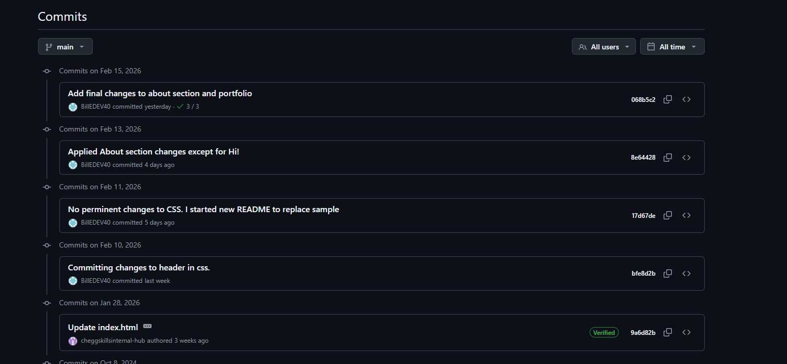

# Project Description
This project is to redesing the Pete Thinkful page. The new layout will feature moving to a more horizontal layout. It will rely on mostly on flexbox containers
which will create a more interesting layout for visitors and enhance the viewing of the page.

# Project Tradeoffs
Moving to a more horizontal layout could make it more challenging for viewers on mobile devices, even with adding different flex properties to compensate for it.

# AI Use Justification
AI tools were not used in this project other than general web seraches and short YouTube videos for addtiona support of the information provided in the course.

# Challenges and Troubleshooting
My biggest challenge getting the allignment correct and realizing the need for additional classes to make the layout work in the different sections. I also need to remember 
running git push after making commits.
# Github and Replit (VSC) Screenshots

